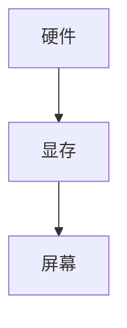

## 显示文字到屏幕

```asm
mov ax,0xb800;   指向屏幕文本模式的显示缓冲区
mov es,ax; es 是段寄存器

mov byte [es:0x00],'I'
mov byte [es:0x00],0x07
jmp $
times 510 - ($-$$) db 0
 ; 为什么是 510 不是512呢？ 因为最后2个字要填充魔数 ，0xaa55
DW 0XAA55    


```


[参考博客文章](https://blog.csdn.net/Insist0224/article/details/103810035)


```asm
mov byte [es:0x00], 'L'
;将"字符L的ASCII码"存储到显存的第一个存储单元中
;move byte [es:0x01], 0100 1100b / 76 /0x4C  
;（L ASCII码的二进制形式/十进制形式/十六进制形式）
;如果地址指令前没有byte，那地址指令[es:0x00]`未指明是多少位，因此编译器无法判断第一条指令是8位还是16位
;不需要修饰:mov [00], AL / mov AX, [00]
mov byte [es:0x01], 0x07
;将"字符L的属性"存储到显存的第二个存储单元中
;属性值07:黑底白字、无闪烁、无加亮

mov byte [es:0x02], 'a'
mov byte [es:0x03], 0x07

mov byte [es:0x04], 'b'
mov byte [es:0x05], 0x07

mov byte [es:0x06], 'e'
mov byte [es:0x07], 0x07

mov byte [es:0x08], 'l'
mov byte [es:0x09], 0x07

mov byte [es:0x0a], ' '
mov byte [es:0x0b], 0x07

mov byte [es:0x0c], "o"
mov byte [es:0x0d], 0x07

mov byte [es:0x0e], 'f'
mov byte [es:0x0f], 0x07

mov byte [es:0x10], 'f'
mov byte [es:0x11], 0x07

mov byte [es:0x12], 's'
mov byte [es:0x13], 0x07

mov byte [es:0x14], 'e'
mov byte [es:0x15], 0x07

mov byte [es:0x16], 't'
mov byte [es:0x17], 0x07

mov byte [es:0x18], ':'
mov byte [es:0x19], 0x07


```







## 磁盘移臂调度算法

汇编里面就是基本自己操作磁盘，硬件之类的，这个必须要知道


链接：https://www.nowcoder.com/questionTerminal/ef386da72cf94d629d8a39b4ee2b3278
来源：牛客网

移臂调度算法又叫磁盘调度算法，根本目的在于有效利用磁盘，保证磁盘的快速访问。
1） 先来先服务算法：该算法实际上不考虑访问者要求访问的物理位置，而只是考虑访问者提出访问请求的先后次序。有可能随时改变移动臂的方向。
2） 最短寻找时间优先调度算法：从等待的访问者中挑选寻找时间最短的那个请求执行，而不管访问者的先后次序。这也有可能随时改变移动臂的方向。
3） 电梯调度算法：从移动臂当前位置沿移动方向选择最近的那个柱面的访问者来执行，若该方向上无请求访问时，就改变臂的移动方向再选择。
4） 单向扫描调度算法。不考虑访问者等待的先后次序，总是从0号柱面开始向里道扫描，按照各自所要访问的柱面位置的次序去选择访问者。在移动臂到达最后一个柱面后，立即快速返回到0号柱面，返回时不为任何的访问者提供服务，在返回到0号柱面后，再次进行扫描。


## 将第二个扇区里面的内容加载进入内存

1. mbr
2. loader


[Grub 引导学习](https://www.bilibili.com/video/BV1Bq4y1b77G/?spm_id_from=333.788&vd_source=5680f9cc1e793f7b70191c94d5552ecb)


## 实现 multi boot , grub 规范


## 操作系统编译和连接

[编译连接原理](https://www.bilibili.com/video/BV1Q5411w7z5?p=5&vd_source=5680f9cc1e793f7b70191c94d5552ecb)


- ELF 介绍
- ELF文件格式
- ELF 文件处理相关工具： binutils


executable linkable format , 可执行 的，可链接的文件格式， 是 unix系统上的二进制文件格式标准


elf文件的结构

1. elf header
2. program header table
3. .text
   - 执行程序的指令
4. .init
   - 初始化变量的时候用的
5. .data
   - 数据，常量，全局变量
6. .bss
7. ..
8. section header table


## binutils 工具介绍

ar： 归档文件，多个文件打包成一个大文件
as:   被gcc调用，输入汇编文件，输出目标文件供链接器ld连接
ld: GNU 链接器，被gcc调用，将目标文件和各种库文件结合起来，重定位数据，并链接符号引用
objcopy 文件各自转换
objdump:显示 elf文件个信息

